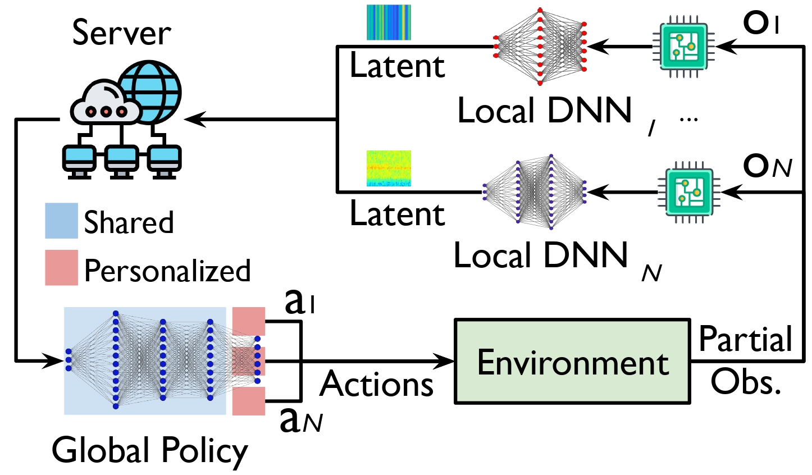
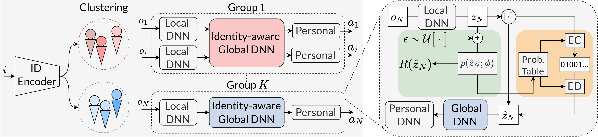

# SDE-HARL
This repo is the official implementation for SDE-HARL: Scalable Distributed Policy Execution for Heterogeneous-Agent Reinforcement Learning (AAAI 2026). This repository allows researchers and practitioners to easily reproduce our results on seven challenging benchmarks or apply SDE-HARL algorithms to their intended applications.

## Architecture



## Framework



## Installation

### Install HARL

```shell
conda create -n sde-harl python=3.8
conda activate sde-harl
# Install pytorch>=1.9.0 (CUDA>=11.0) manually
git clone https://github.com/Restuccia-Group/SDE_HARL.git
cd HARL
pip install -e .
```

### Install Environments

We implement SDE-HARL on [SMAC](https://github.com/oxwhirl/smac), [SMACv2](https://github.com/oxwhirl/smacv2), and, [Google Research Football](https://github.com/google-research/football). However, you can install [MAMuJoCo](https://github.com/schroederdewitt/multiagent_mujoco), [MPE](https://pettingzoo.farama.org/environments/mpe/), [Bi-DexterousHands](https://github.com/PKU-MARL/DexterousHands), and [Light Aircraft Game](https://github.com/liuqh16/CloseAirCombat) to research purposes. 

**Install Google Research Football**

Please follow [the official instructions](https://github.com/google-research/football) to install Google Research Football.

**Install SMAC**

Please follow [the official instructions](https://github.com/oxwhirl/smac) to install SMAC. We use StarCraft II version 4.10 on Linux.

**Install SMACv2**

Please follow [the official instructions](https://github.com/oxwhirl/smacv2) to install SMACv2.

## How to Run

## Usage

### Training on Existing Environments

To train an algorithm on a provided environment, users can modify yaml configuration files of the corresponding algorithm and environment under `harl/configs/algos_cfgs` and `harl/configs/envs_cfgs` as they wish, go to `examples` folder, and then start training with a one-liner `python train.py --algo <ALGO> --env <ENV> --exp_name <EXPERIMENT NAME>` or `python train.py --load_config <CONFIG FILE PATH> --exp_name <EXPERIMENT NAME>`, where the latter is mostly used when reproducing an experiment. We provide the **tuned configurations** for algorithms in each environments under `tuned_configs` folder. Users can **reproduce our results** by using `python train.py --load_config <TUNED CONFIG PATH> --exp_name <EXPERIMENT NAME>` and change `<TUNED CONFIG PATH>` to the absolute path of the tuned config file on their machine.

During training, users receive continuous logging feedback in the terminal.

After training, users can check the log file, tensorboard output, experiment configuration, and saved models under the generated `results` folder. Moreover, users can also render the trained models by setting `use_render: True`, `model_dir: <path to trained models>` in algorithm configuration file (for football users also need to set `render: True` in the environment configuration file), and use the same training command as above again. For SMAC and SMACv2, rendering comes in the form of video replay automatically saved to the `StarCraftII/Replays` folder (more details can be found [here](https://github.com/oxwhirl/smac#saving-and-watching-starcraft-ii-replays)).

To enable batch running, we allow users to modify yaml configs in the command line. For each training command, users specify the special parameters in the commands with the same names as in the config files. For example, if you want to run HAPPO on SMAC tasks under three random seeds. You can customize the configs and replace `train.sh` with the following commands:

```shell
python train.py --algo happo --env smac --exp_name test --seed $seed

```

## Prototype

To evaluate the resource consumption, we implement a real-world prototype with some Raspberry Pi/Jetson Nano serve as low-power devices, and a super workstation as the server.


## Acknowledgements

This repo is based on **official implementation** of **Heterogeneous-Agent Reinforcement Learning** at [HARL](https://github.com/PKU-MARL/HARL), serving as core HARL aglorithms as well as baselines. Secondly, we use compression library at [CompressAI](https://github.com/InterDigitalInc/CompressAI). Finally, we inspire our IAD and RAD approaches relies on source [CDS](https://github.com/lich14/CDS). 


Thanks to the original authors for their work!

## Citation

Please cite this work if you find it useful.

Our work:

For any work related to the variable bitrate models, please cite

```tex
@article{JMLR:v25:23-0488,
  author  = {Yifan Zhong and Jakub Grudzien Kuba and Xidong Feng and Siyi Hu and Jiaming Ji and Yaodong Yang},
  title   = {Heterogeneous-Agent Reinforcement Learning},
  journal = {Journal of Machine Learning Research},
  year    = {2024},
  volume  = {25},
  number  = {32},
  pages   = {1--67},
  url     = {http://jmlr.org/papers/v25/23-0488.html}
}
```

```tex
@inproceedings{
liu2024maximum,
title={Maximum Entropy Heterogeneous-Agent Reinforcement Learning},
author={Jiarong Liu and Yifan Zhong and Siyi Hu and Haobo Fu and QIANG FU and Xiaojun Chang and Yaodong Yang},
booktitle={The Twelfth International Conference on Learning Representations},
year={2024},
url={https://openreview.net/forum?id=tmqOhBC4a5}
}
```
```
@article{begaint2020compressai,
	title={CompressAI: a PyTorch library and evaluation platform for end-to-end compression research},
	author={B{\'e}gaint, Jean and Racap{\'e}, Fabien and Feltman, Simon and Pushparaja, Akshay},
	year={2020},
	journal={arXiv preprint arXiv:2011.03029},
}
```
```
@article{chenghao2021celebrating,
  title={Celebrating diversity in shared multi-agent reinforcement learning},
  author={Li, Chenghao, and Wang, Tonghan and Wu, Chengjie and Zhao, Qianchuan and Yang, Jun and Zhang, Chongjie},
  journal={Advances in Neural Information Processing Systems},
  volume={34},
  year={2021}
}
```

